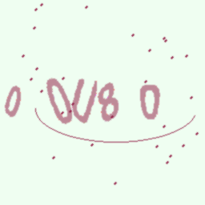

# CaptchaBypass



This project uses Generative Adversarial Networks (GANs) to generate realistic captcha images that augment training data for convolutional neural network (CNN) based OCR models.

The GAN implementation is a Conditional Generative Adversarial Network (CGAN), which conditions the generator on target text labels to produce matching captcha images. Using generated samples alongside real captchas can improve OCR robustness.

---

## Features
- Generate diverse 256x256 captcha images with a CGAN.
- Train CNN-based OCR models using real + generated data.
- Simple dataset integration and example scripts.

---

## Setup
Install required libraries:

```bash
pip install -r requirements.txt
```
---

## Update dataset paths in the scripts to point to your local dataset.

Models were trained on 256x256 images which can be found at: 
https://www.kaggle.com/datasets/akashguna/large-captcha-dataset


For CGAN.py 
```bash
dataset = CustomDataset("your file path", transform=transform)
```

For OCRmodel.py
```bash
dataset = CaptchaDataset("your file path")
```
---


